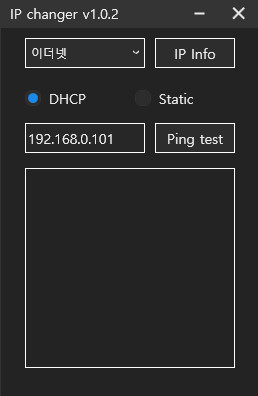
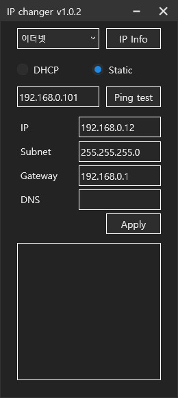
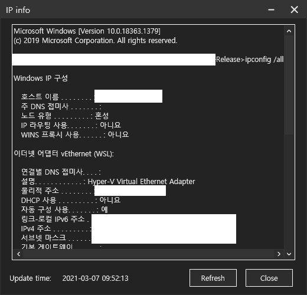

# IP changer with WPF

  

## Getting Started
- Download the latest release
- Execute IP changer as Administrator

## How to Use
### To static address
1. Select newtwork adaptor using combobox
2. Select static
3. Window extends like below

4. Write down address you wanted (IP, Subnet, Gateway : essential)
5. Push Apply button

### To DHCP address
1. Select newtwork adaptor using combobox
2. Select DHCP

### How to show network adpater configuration
Push IP Info button

## Status
- Completed developing major functions
- Minor revision in progress

## References
- [WPFDarkTheme](https://github.com/AngryCarrot789/WPFDarkTheme)
